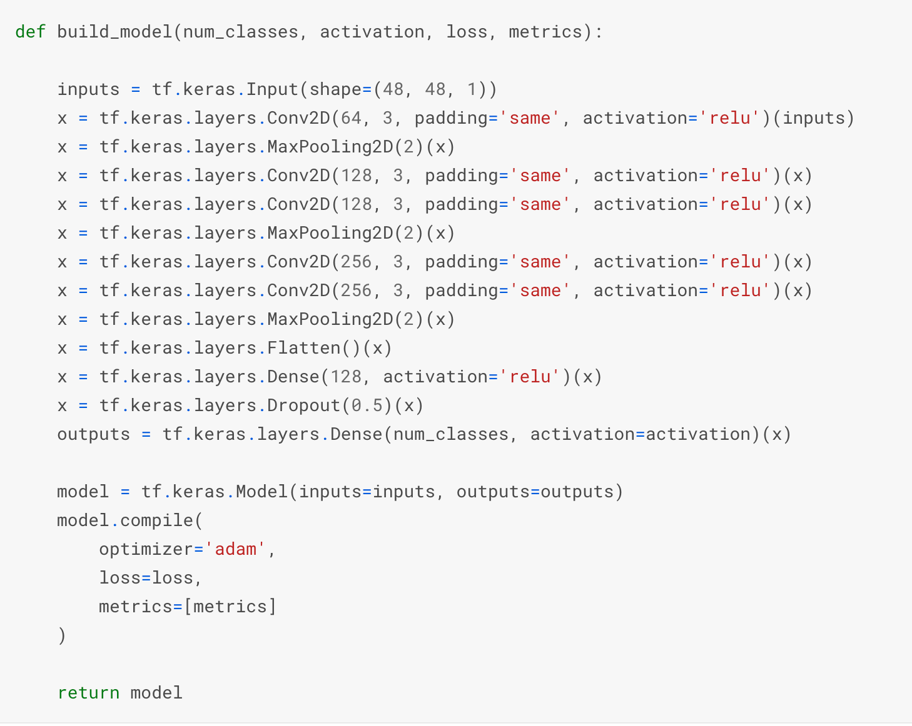

# Objective
To build a gender, age and ethnicity detector that can approximately guess the gender,age and ethnicity of the person (face) in a picture.
# Project
In this Project, I had used Deep Learning to accurately identify the gender,age and ethnicity of a person from a single image of a face. Input image for prediction was taken through Telegram Bot.

Two models were created:
1. Custom Model
2. Using Technique of Transfer Learning MobileNet Model was created.

## Technologies:
- Programming Language: Python
- Libraries: Pandas, Numpy, Tensorflow

## Custom Model

## Results

